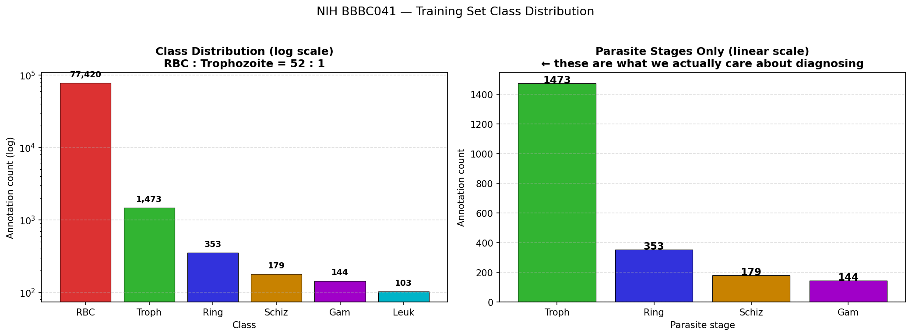
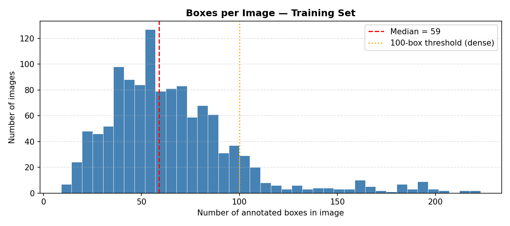
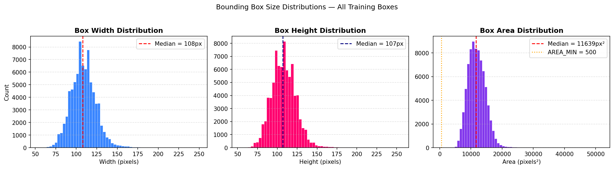
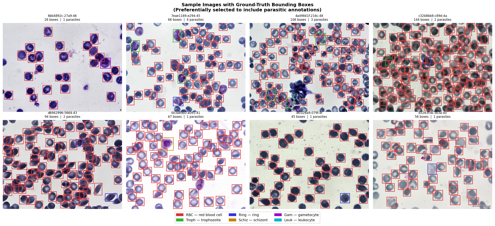
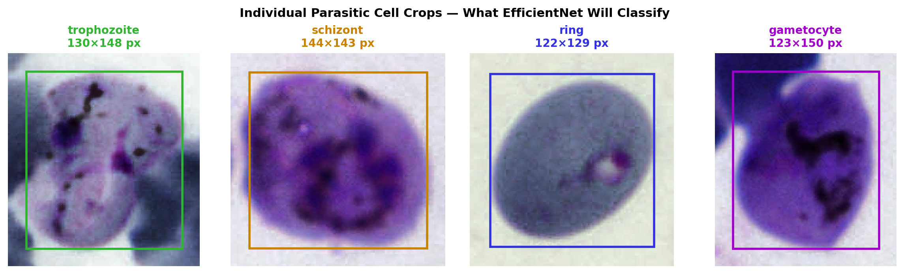

# EDA Overview — NIH BBBC041 Malaria Dataset

> **Generated from:** `Phase1_EDA.ipynb`
> **Dataset:** NIH BBBC041 — Giemsa-stained *P. falciparum* thin blood smears
> **Source:** [Broad Bioimage Benchmark Collection](https://bbbc.broadinstitute.org/BBBC041)

---

## 1. Dataset Summary

| Split | Images | Annotated Boxes |
|---|---|---|
| Training | 1,208 | 79,672 |
| Test | 80 | 5,917 |

---

## 2. Class Distribution



### Training Set — Raw Counts

| Class | Count | % of Total | Ratio vs RBC |
|---|---|---|---|
| Red Blood Cell | 77,420 | 97.2% | 1 : 1 |
| Trophozoite | 1,473 | 1.85% | 1 : 52 |
| Ring | 353 | 0.44% | 1 : 219 |
| Schizont | 179 | 0.22% | 1 : 432 |
| Gametocyte | 144 | 0.18% | 1 : 537 |
| Leukocyte | 103 | 0.13% | 1 : 751 |

**Key finding:** The dataset is extremely class-imbalanced. There is a **537:1** ratio of red blood cells to gametocytes. This motivates using **Focal Loss** with inverse-frequency class weighting in Stage 2 of the pipeline, instead of standard cross-entropy.

> **Also note:** The training annotations are *incomplete* — the majority of healthy RBCs in each image are NOT individually labelled. This is the core motivation for the Stage 1 watershed approach: it finds every cell regardless of whether a label exists.

---

## 3. Image Size & Resolution

```
Unique image sizes: 1
  1600 × 1200 — appears in 79,672 box records

Image resolution: 1600 × 1200 pixels
Aspect ratio:     1.333  (landscape)
Megapixels:       1.92 MP

Median cell width  : 108.0 px  (6.8% of image width)
Median cell height : 107.0 px  (8.9% of image height)

>> At ~108px on a 1600px-wide image, cells are small but not tiny.
>> FPN's P3 feature map (stride 8) will cover them well.
```

**All images are exactly 1600×1200.** This makes anchor scale design for Faster R-CNN straightforward, and means we don't need to worry about variable-size preprocessing for the watershed stage.

---

## 4. Annotation Density (Boxes per Image)



```
Boxes per image — Training set:
  Min    : 9
  Max    : 223
  Mean   : 66.0
  Median : 59.0
  Std    : 34.6
  90th % : 103.0
  95th % : 136.6

  Images with >100 boxes: 133  (11.0%)
  >> These are the dense smears where NMS will struggle most.
```

**Key finding:** 11% of images contain more than 100 annotated cells. In these dense smears, NMS-based detectors (Faster R-CNN, YOLO) will suppress overlapping proposals even when they correspond to genuinely distinct cells. This is **Novelty Claim N2** — the watershed Stage 1 separates touching cells before any NMS is applied.

---

## 5. Cell (Bounding Box) Size Distribution



```
Bounding box dimensions (all training boxes):
  Width  — mean: 108.7  median: 108.0  p5: 85.0   p95: 133.0
  Height — mean: 108.0  median: 107.0  p5: 84.0   p95: 133.0
  Area   — mean: 11845  median: 11639  p5: 7644   p95: 16510

Per-class median box area:
  red blood cell          median =  11544 px²  (n=77,420)
  trophozoite             median =  17272 px²  (n=1,473)
  ring                    median =  15184 px²  (n=353)
  schizont                median =  20572 px²  (n=179)
  gametocyte              median =  17554 px²  (n=144)
  leukocyte               median =  13632 px²  (n=103)

>> EfficientNet crop size recommendation:
   Use 64×64. Median cell is 108px — after resize to 64,
   the model sees the full cell. Add 6px margin before cropping.

>> Watershed AREA_MIN recommendation:
   p5 area = 7644 px². Set AREA_MIN = 500 px²
   (rejects dust/stain artefacts, keeps smallest real cells)
```

**Key findings:**
- All RBCs are roughly the same physical size (~8 µm diameter). At 1600×1200px resolution this corresponds to ~108px width.
- Parasite stages (ring, trophozoite, schizont, gametocyte) are *inside* RBCs, so their bounding boxes are **similar in size** to RBC boxes — the model must learn from texture and morphology *inside* a box, not box size alone.
- This justifies a **64×64 crop** for EfficientNet with a 6px margin around each detected cell.

---

## 6. Sample Images (Ground-Truth Overlays)



*Images selected to contain at least one parasitic cell. Green = RBC, Red = parasitic stage.*

**Visual observations from the sample images:**
1. Cells are densely packed and frequently **overlap and touch** — NMS will delete valid detections in these regions.
2. You can clearly see **unannotated RBCs** adjacent to annotated ones — confirming the incomplete annotation problem.
3. Parasitic stages are visually distinguishable by **internal morphology** (purple stained nucleus dots) — this is what Stage 2 must learn.
4. Leukocytes (white blood cells) are visually distinct (larger, lobular nuclei) and are present but rare.

---

## 7. Design Decisions Driven by EDA

| Decision | EDA Evidence |
|---|---|
| **Watershed for Stage 1 (not a trained detector)** | Annotation is incomplete — end-to-end detectors treat unlabelled RBCs as background. Watershed finds all cells regardless of labels. |
| **Focal Loss (γ=2) in Stage 2** | 537:1 class imbalance (RBC vs gametocyte). Standard cross-entropy will be dominated by RBC loss. |
| **Inverse-frequency class weights** | Same class imbalance. Weighted sampler ensures rare classes appear in every batch. |
| **64×64 crop size for EfficientNet** | Median cell is 108px. Resizing to 64px still preserves full cell context. |
| **6px margin around crops** | Provides boundary context for morphological classification. |
| **AREA_MIN = 500 px² for watershed** | p5 box area is 7644 px². 500 px² safely filters dust but keeps smallest real cells. |
| **Dense smear evaluation metric** | 11% of images have >100 boxes — dense regions are where the two pipelines will diverge most in recall. |

---

## 8. Parasite Crop Gallery



*Cropped examples of each parasite stage from the training set, resized for display. Note the consistent circular RBC boundary and the distinct internal staining of each stage.*
